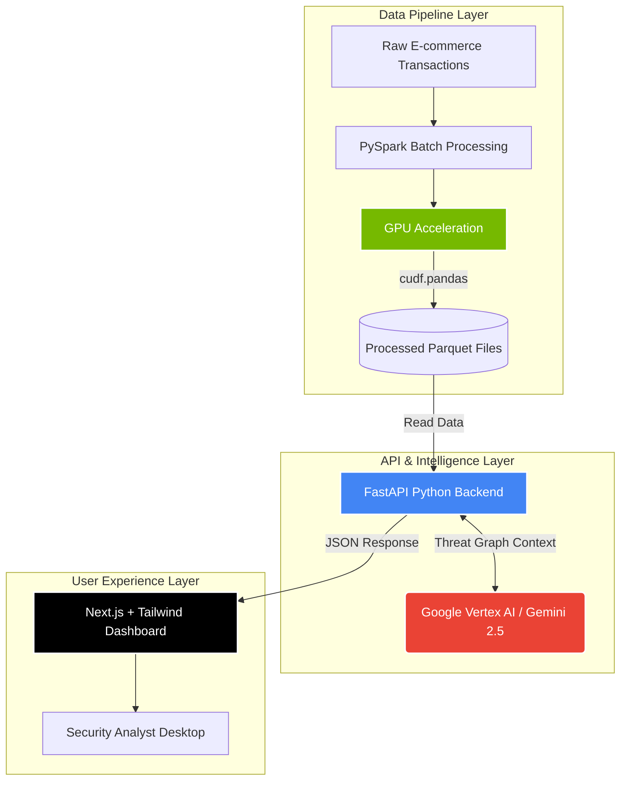
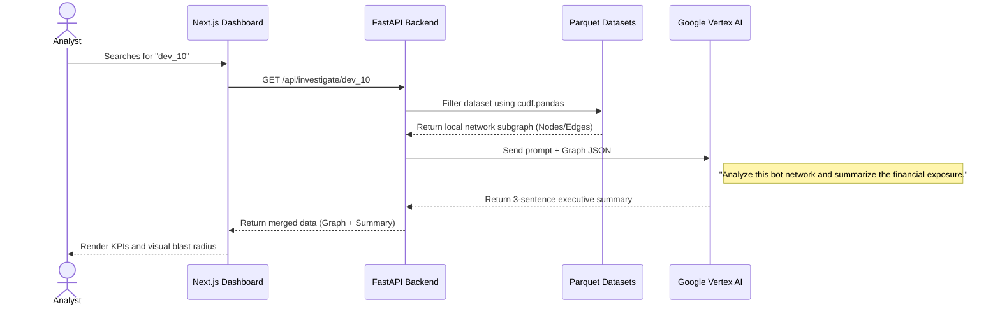

# 🛡️ Sentinel: Real-Time Fraud & Bot Network Investigator

<p align="center">
  
  
  
  
</p>

**Sentinel** is a decision-support application built for enterprise security analysts to detect and investigate coordinated fraud rings during high-velocity e-commerce events. 

It ingests massive amounts of transaction logs, utilizes **NVIDIA GPU-accelerated processing (`cudf.pandas`)** to find hidden network connections (shared IPs, subnets, device IDs), and outputs a highly visual "blast radius" dashboard. 

The entire investigation is powered by **Google's Gemini 2.5 Flash** (via Vertex AI), which synthesizes complex graph data into an actionable, human-readable threat summary.

---

## 🏗️ High-Level Architecture

Sentinel is split into three main operational zones: the **Data Pipeline**, the **Backend API**, and the **Frontend Dashboard**.



---

## ⚡ Core Technologies

1. **Backend (Python / FastAPI)**
   - Fully asynchronous web server tailored for high-speed API responses.
   - **`cudf.pandas`**: A zero-code-change accelerator by NVIDIA. It allows the backend to execute standard Pandas DataFrame operations natively on GPUs, offering 10x-100x speedups without changing a single line of Pandas code.
2. **AI Engine (Google Vertex AI)**
   - Utilizes the `google-genai` SDK and Application Default Credentials (ADC) to query **Gemini 2.5 Flash**.
   - Gemini acts as a virtual "Junior Analyst," looking at the complex graph of fraudulent accounts and generating a concise, actionable summary.
3. **Frontend (Next.js / React)**
   - Dark-mode, highly responsive UI styled with Tailwind CSS.
   - Includes real-time threat KPIs (Risk Score, Financial Exposure).

---

## 🔍 Investigation Flow: How it works

When a security analyst inputs a suspicious `Device ID` into the dashboard, a complex series of backend interactions take place in milliseconds:



---

## 🚀 Deployment Guide (Google Cloud Run)

The application is completely containerized and optimized for serverless deployments on Google Cloud Run.

### Prerequisites
- Google Cloud SDK (`gcloud`) installed.
- Application Default Credentials (ADC) configured on your machine via:
  ```bash
  gcloud auth application-default login
  ```
- Project configured for Vertex AI access.

### 1. Deploy the Backend API
The backend uses a standard Python Dockerfile. Note that while `cudf-cu12` is available for GPU acceleration, it requires a GPU-enabled environment (like GKE or Cloud Run GPU Preview). For standard Cloud Run, standard pandas is used.

```bash
cd sentinel
gcloud run deploy sentinel-api \
  --source . \
  --project <YOUR_PROJECT_ID> \
  --region us-central1 \
  --allow-unauthenticated
```
*Note down the Service URL provided after deployment.*

### 2. Connect and Deploy the Frontend
Open `sentinel-frontend/app/page.tsx` and update the fetch command to point to your new API URL:
```typescript
const response = await fetch(`https://sentinel-api-[HASH].run.app/api/investigate/${deviceId}`);
```

Then deploy the frontend container:
```bash
cd sentinel-frontend
gcloud run deploy sentinel-ui \
  --source . \
  --project <YOUR_PROJECT_ID> \
  --region us-central1 \
  --allow-unauthenticated
```

---

## 💻 Local Development

### Generate Mock Data
The backend relies on synthetic e-commerce transaction data.
```bash
cd sentinel
python3 -m venv venv
source venv/bin/activate
pip install -r requirements.txt
python data_generator.py
```
*(This generates 1 million rows of transaction data into the `data/` folder).*

### Start the API Server
```bash
cd sentinel
pip install -r backend/requirements.txt
uvicorn backend.main:app --reload
```

### Start the Frontend Dashboard
```bash
cd sentinel-frontend
npm install
npm run dev
```
Open `http://localhost:3000` to view the dashboard!

---
*Developed for advanced threat detection and high-speed graph analytics.*
